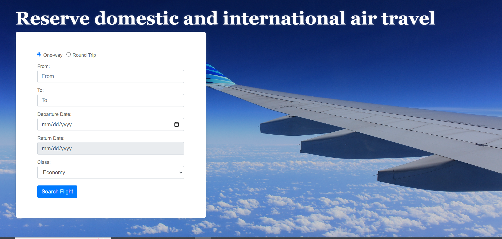

# Afghan-flight-booking-system

A Django application for booking flights that is coded in Python, HTML, CSS, and Javascript. The final project for the CS50 course Web Programming with Python and Javascript is this one.

